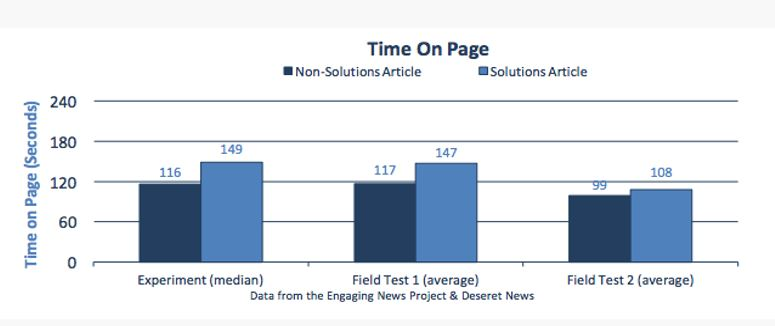
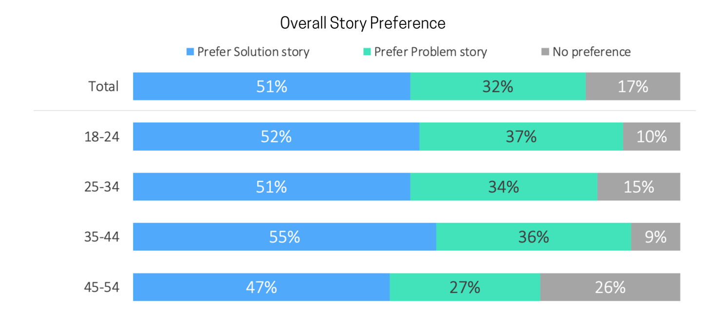

# 쟁점과 과제 {#intro}

### 해결중심 감염병보도의 쟁점과 과제 {-}

##### 안도현 이규원 이미나 이정환 조동찬 정의철 {-}

감염병보도 품질측정의 문제를 해결지향의 접근으로 다뤘다. 이를 위해 해결지향 보도에 대한 기존 논의와 쟁점에 대해 정리하고, 해결지향 보도가 극복해야 할 과제에 대해 논했다. 

해결지향 보도는 솔루션저널리즘네트워크의(Solutions Journalism Network: SJN)을 통해 확산 중이다(Solutions Journalism, 2020.12.10, n.d.). 국내에서는 언론현장(이정환, 2019.8.30, 2019.10.23, 2020.7.13, 2021)과 학계(강준만, 2019; 이상기, 2018; 진민정 이준형, 2019) 및 현장과 학계의 공동작업(이규원 이미나, 2021)이 있다. 보다 체계적인 접근으로는 솔루션 저널리즘에 대한 개념화와 조작화 시도가 있다 (McIntyer & Lough, 2019).

해결지향 보도 개념 자체는 저널리즘의 역사만큼 오래됐지만 최근에서야 체계적인 논의가 시작됐기 때문에 해결해야 할 과제와 쟁점이 적지 않다. 

- 해결지향보도는 어떻게 정의할 수 있고, 어떻게 측정하고 판단할 것인가?   
-	적절한 용어는 무엇인가? ‘해결 저널리즘’, ‘해법 저널리즘’, ‘해결지향 저널리즘’ , ‘솔루션 저널리즘’ 등 여러가지 중 적절한 용어는 무엇인가?   
-	건설적 저널리즘(Constructive journalism)과 솔루션 저널리즘의 관계를 어떻게 설정할 것인가?   
-	SJN은 솔루션 저널리즘을 '엄격한 보도'라고 정의하는데, 심층보도만이 솔루션 저널리즘이 되는가? 뉴스는 사실전달이 핵심 기능인데 심층보도가 아닌 사실전달 중심의 보도는 솔루션 저널리즘이 될수 없는가?  만일, 사실전달 중심의 보도가 해결지향의 요건을 갖추러면 어떤 식의 구조와 내용이 포함되어야 하는가?   
-	뉴스가치의 핵심 요인이 일탈성(deviance)과 사회적중요성(social ignificance)다. 이중 일탈성의 가치를 중심으로 한 언론매체의 관심끌기 경쟁에서 해결지향 보도가 상업적 경쟁력을 갖출 수 있는가?  


## 기존 논의

### 해결지향보도의 범위

해결지향 보도에 대해서는 미국의 언론 현장에서 출발한 솔루션 저널리즘과 유럽에서 출발한 건설적 저널리즘이 있다. 두 접근의 기본 방향은 같지만, 차이도 있다. 브로(Bro, 2008)는 저널리즘 연구의 규범적 접근을 적용해 사회현상의 반영과 능동적 개입의 축을 이용해 두 접근을 구분했다. 사회현상의 반영으로서의 해결지향 보도는 관찰자로서 사회현상의 모든 측면(부정사건과  긍정사건의 실제 발생 비율에 맞춰 전달)을 전달하는 보도양식이다. 반면 능동적 개입으로서의 해결지향 보도는 언론보도가 사회 현상에 능동적으로 개입해 사회변화를  유도하는 저널리즘이다. 사회문제에 대한 가능한 해법을 비판적으로 탐색하는 보도 양식이라 할수 있다. 

### 솔루션저널리즘네트워크의 접근

SJN(2020.12.10)은 솔루션 저널리즘을 사회문제의 대응에 관한 엄격한 보도(rigorous reporting on responses to social problems)로 정의하며 그 대응이 어떻게 작동했고 어떻게 작동하지 않는지 전하며, 대응을 통해 통찰을 제공하고,  대응의 효과(또는 효과의 부재)에 대한 근거를 찾아 대응의 한계를 제시 등의 면밀한 보도라며, SJN은 솔루션저널리즘의 4대 요소를 다음과 같이 제시한다. 

 - 사회문제의 대응(response)에 초점(그 대응이 어떻게 작동했고, 어떻게 작동하지 않는지.)  
 - 대응을 통해 통찰 제공  
 - 대응의 효과(또는 효과의 부재)에 대한 근거 추구  
 - 대응의 한계 제시  
 
 
#### 솔루션저널리즘이 아닌 것
솔루션저널리즘은 명칭에 해법(solutions)이 들어 있어 솔루션저널리즘이 아님에도 불구하고 솔루션저널리즘으로 오해하는 경우가 많다. 오류를 회피하기 위해 표면적으로는 솔루션저널리즘처럼 보이나 실은 솔루션저널리즘이 아닌 사례는 다음과 같다(McIntyer & Lough, 2017; 이규원 이미나, 2021).

- 긍정적인 소식만을 전하는 보도양식은 광범한 사회적 중요도가 결여될수 있기에 해법 저널리즘의 기준에 부합하지 않는다. 

  1. 행복한 결말이나 개인의 성공담을 전하는 '좋은 소식' 
  작동했던 것과 작동하지 않은 것 모두에 초점필요. 
  예: 크록스 신발 – 축구공이 부족한 나라를 위해 신발을 재활용해 축구공을 만듦. 친환경적이고 좋아보이지만, 무게가 엄청나 운반비용이 상당히 많이 든다는 한계가 발생 (비용적 한계) 
  
  2. 개인을 칭송하는 영웅담
  개인의 영웅담을 소개하는 보도는 사회문제에 대해 체계적 대응을 한 것이 아니기 때문에 해결지향 보도가 아니다. 개인은 체계적 변화에 대해 말하는 장치로 활용 필요.
  
  3. 선한 행동 사례 전달
  특정 문제에 대한 대응이 이 세상 모든 문제를 해결해줄 수 있을 것 처럼 과장될 가능성이 있다. 문제에 대한 대응을 적용하고, 그렇지 못한 내용을 포함해야 한다.  
  예: 탐스슈즈  - 하나 사면 다른 하나는 기부 내용은 좋아보이지만 해결지향 보도가 아니다. 신발을 무료로 배급한 지역에서는 신발산업이 침체돼 지역경제에는 부정적 영향 미쳤다. 
  
  4. 추상적인 논리(실제로 발생한 사건과 그에 대한 과정)
  단순히 ‘이렇게 하면 좋지 않을까요’ 류의 아이디어 제시는 근거가 없기 때문에 해결지향 보도가 아니다. 실제로 실행된 다음 효과가 있는지 없는지 확인하는 게 해결지향 보도 
  
  5. 언론이 해결사 역할
  해결지향 보도는 언론이 직접 사회문제 해결에 참여하는 것이 아니므로 옹호 저널리즘(advocacy journalism)이나 시민저널리즘(civic journalism)과도 구분. 
  예:  특정 지역에 있는 음식물쓰레기 문제를 해결하기 위해 기부를 해달라는 식의 보도보다는 사회적 문제에 대한 대응이 체계적으로 잘 이루어져 효과적으로 진행된 사례에 대해 더 집중해서 보도하는 것이 해결지향 보도.

- 대안 탐색의 오류
해결지향 보도가 문제를 진단하고, 대안을 탐색하는 보도이나 그 대안이 사실은 대안이 아닐 수가 있다. 이는 잠정적 대안에 대한 충분한 검토 없이 취재가 이뤄지기 때문이다. 예를 들어, ‘공공병원이 부족해서 이를 설치해야 코로나 극복 가능’ 하다는 시각의 보도. KBS, MBC, JTBC 등은 공공병원 설립의 중요성을 주제로 독일, 영국 등 찾아가 해외 취재했다. 

문제는 학술지 <Lancet>에는 반대 내용의 기고문이 실렸다는 사실이다. 이 기고문은 ‘영국의 내셔널 헬스 시스템은 코로나19라는 이런 위기에서 공공병원의 비효율성과 탄력 없음을 증명한 스캔들이다’ 라는 내용이다. 공공병원이 코로나19 대응 시 비효율적이있고, 오히려 영국, 독일, 프랑스가 공공병원의 비중을 줄이고 한국처럼 민간 병원을 늘려야 취지의 글이다. 실제로 코로나19 뿐 아니라 대부분의 질병 대응에서도 한국 지표가 영국 지표보다 앞선다 (조동찬, 2021). 


#### 솔루션 저널리즘의 정의에 공통적으로 적용되는 요소

 - '사회문제에 대한 대응', '포괄적이고도 중요한 주제', 및 '엄격한 방법의 적용'
 
맥킨타이어와 라프(McInyre & Lough, 2019)는 SJN에서 솔루션 저널리즘 훈련을 마친 SJN 회원 27명을 대상으로 심층면담을 수행해 솔루션 저널리즘에 대한 판단기준(operationalization)을 다음과 같이 제시했다 (p. 11). 

> ■ 뉴스보도는 사회문제의 원인을 포함해야 하나, 그 문제에 대한 대응에 보다 더 많은 가중치를 두는 방식으로 뉴스의 틀(frame)을 구성해야 한다. 즉, 보도서사에서 문제해결 과정이 중심에 있어야 한다. 보도의 양도 문제에 대한 내용보다는 대응에 관련된 내용이 더 많이 포함돼야 한다. 문제의 대응은 기사의 앞부분에 언급되는 것이 좋다. 앞부분에 언급되지 않는 경우 기사의 절정에 언급함으로써 독자들이 기사의 초점이 문제에 대한 대응이라는 것을 알도록 한다.

> ■ 대응은 구체적이어야 하며 가설적이어서는 안된다.

> ■ 기사는 엄격하고 포괄적이어야 한다. 이를 위해 '누가 무엇을 언제 어디서 왜'에 대한 요소를 포괄하면서 '어떻게' 대응이 실행되는지에 대해 특별한 주의를 기울여야 한다.

> ■ 대응의 영향에 대한 분명한 근거(hard evidence)가 포함돼야 한다. 분명한 근거는 신뢰성 있는 자료를 의미한다. 일화적인 정보가 아니다. 

> ■ 기사는 대응의 한계를 설명해야 한다. 

> ■ 기사는 수용자가 이용할 수 있는 정보를 포함해야 한다. 


### 기존 연구의 개념화 종합
#### 해외 연구자들의 정의(McIntyer & Lough, 2017)
- 독자와 시청자들이 긍정적인 변화에 참여하도록 해법기반 사례를 보도하는데 초점을 둔 저널리즘' (Loizzo et al., 2017)

- '사회문제를 단순히 보도하는데 벗어나, 문제에 대한 대응을 관찰해 보다 온전하게 사회현상을 다루는 저널리즘' (Midberry & Dahmen, 2017), 

- '해법이 왜 그리고 어떻게 작동하는지에 대한 포괄적인 탐색을 강조하는 접근으로서 언론이 변화를 위한 청사진을 제공하고 공중담론의 논조를 바꾸도록 기존 저널리즘을 재구성한 보도양식' (Thier, 2016) 

##### 감시견(watchdog)에서 안내견(guidedog)으로
- 감시견: 고발
- 안내견: 고발 + 대안 탐색
- 사례: 미국 오하이오주 클리블랜드 의 납중독 사건. 
클리브랜드시의 중소규모 아파트에서 아이들이 페인트에 함유된 납에 중독되는 고질적 문제가 있었다. 지역 신문사에서 탐사보도 팀 꾸려서 감시견 역할 수행. 피해 사실에 대해 근거와 함께 실태 고발했으나, 사회에 대한 영향은 없었다. 

이후 2015년 안내견 접근 시도. 문제 고발에 머물지 않고 미시간, 뉴욕 등 다른 도시 상황과 비교해 보도했다. 이들 도시에서는 클리브랜드에 비해 정상적인 행정처리 기준 적용. 보도 이후 책임자 문책이뤄지고, 담당자 증원(도시 공무원 수 3명에서 7명으로 두 배 이상 증가) 등 조치했다. 또한 모든 임대 사업자들이 납성분 무검출 증명서 의무화.(이규원 이미나, 2021) 


#### 국내 언론전문가의 접근(진민정 & 이준형, 2019)
- '해법을 통해 긍정적 영향을 미치고자 하는 저널리즘'

- '해법을 찾는 과정 혹은 공론화시키는 저널리즘'

- '진단과 처방을 아우르는 저널리즘'

- '의제설정(agenda-setting)에서 해법설정(solutions-setting)으로 진화한 저널리즘'

- '해법을 찾는 것이 중요하다고 인식하게 하는 저널리즘'

- '개별 사안을 문제해결이라는 맥락에서 보도하는 실행의 틀'

- 솔루션 저널리즘은 언론이 해법을 발굴하고 기획해 제안하고 집행하는 보도양식이 아니라, 공중으로 하여금 해법을 찾아 집행할 수 있도록 공론을 형성하는 보도양식


## 쟁점

### 정의 
심층보도만 해결지향보도에 해당하게 되고, 사실전달 보도는 해결지향 보도가 될수 없는가? ‘사회문제에 대한 대응’을 넘어 ‘문제해결의 목적달성에 기여하는’이 돼야 하지 않을까?

문제 지적이나 선정적인 보도라도 문제해결에 기여하는 틀에서 이뤄진다면 해결지향 보도가 될수 있지 않을까? 

그렇다면, 해결지향 보도를 "문제해결을 달성하는데 기여하는 보도"라고 정의할 수 있지 안을까? 

-	(이규원) SJN에서 추구하는 솔루션 저널리즘은 사회 문제의 대응에 대한 구체적 보도. 구체적인 요소를 언급하자면 대응이 어떻게 일어났는지, 대응이 해결할 수 있는 통찰, 대응의 한계로 정리.

- (조동찬) 언론보도가 정치적, 정책적으로 해결점을 찾는 것은 언론의 역할이 아니다. 문제점에 대해 해결점을 내려주지 않고 있는 그대로 보도하는 것이 해결지향 보도가 될 수 있다. 우리 사회가 가지고 있는 맥락을 보여주는 것, 즉 구조적 문제점으로 보여주는 것 자체로 우연히 발생한 문제인지 아니며 정말 사회 구조적인 문제인지 확인이 가능하다고 생각이다. 


> 정의: 사회문제에 대한 체계적 대응을 증거와 효과에 기반해 면밀하게 전달함으로써 사회 현상의 본질을 전달해 개인과 사회가 문제해결의 목적을 달성할 수 있도록 기여하는 보도 방식


### 용어 관련
적절한 용어는 무엇인가? ‘해결 저널리즘,’ ‘해법 저널리즘,’ ‘해결지향 저널리즘’ , ‘솔루션 저널리즘’ 등 여러가지 중 적절한 용어는 무엇인가?

solutions journalism의 한국어명칭은 ‘솔루션저널리즘’인가 ‘해법저널리즘’인가, 혹은 다른 명칭으로 할것인가? 

- (이정환) '해법'이란 용어를 사용하면 선언적이나 계도적이라는 인상을 줄 가능성이 있다. '언론이  답을 내놔야 하는 것인가'라는 의미를 내포하기 때문이다. 언론의 핵심 기능은 사실을 전달하고, 정확하게 정보를 전달하는 것이고, 사회를 감시하고 비판하는데 있다. constructive & solution / solution based 를 생각해보면 ‘해결지향 저널리즘’이라고 하는 게 목적과 가장 비슷할 것 같다. ‘솔루션’이라고 하면 컴퓨터 기반으로 하는 것으로 오해를 살 수도 있다. 

-	(이규원) SJN 에서는 용어에 크게 집착하지는 않는다. 건설적(Constructive) 저널리즘의 용어는 덴마크의 기관에서 사용하는데, SJN과 긴밀하게 협업하는 중이다. 그 기관에서도 솔루션 저널리즘을 통용해서 사용한다. 한국에서도 solution based라는 의미를 살려서 사용하면 좋을 것 같다. 영어의 번역에서 오는 오해를 최소화 하기 위한 표현으로는 ‘해결지향 저널리즘’이 가장 적절할 것 같다. 

-	(정의철) 우리는 최대한 국민들도 이해를 잘 하고,들도 받아들이기 쉽고, 독자들도 잘 이해할 수 있는 표현이 필요하다. 

-	(조동찬) ‘지향’이라는 표현은 언론인으로서 경계해야 한다. '지향'이라고 하면 마치 방향성을 정해놓는 것 같기 때문이다. 언론은 있는 그대로 보도해야지 방향성을 정해 놓고 보도를 하면 안된다. 

-	(정의철) ‘문제해결’이러면 심플한데 ‘해결지향’이라고 하니까 의도를 하는 것처럼 보일 수도 있다. 언론인들의 자율성 측면에서 고민이 좀 더 필요할 것 같다. 

-	(이정환) 언론인들은 어떤 것도 지향하지 않는다라는 개념이 기본에 깔려 있기 때문에 ‘해결 지향’이라는 표현에 거부감이 들 수 있으니 해법에 대한 고민을 기사에 담자라는 용어가 필요하다. '해결' 저널리즘이라고 하면 강한 거부감이 있다. 

-	(정의철) 문제해결이라는 표현은 어떤지? 

-	(조동찬) 그러면 왜가 문제를 해결해야하냐라는 질문에 부딪힐 수 있다. 기사에 해법에 대한 고민을 기사에 담아보자 정도로 접근을 할 것 같은데, ‘문제해결’이라고 규정하면 ‘해법을 위한 보도’라고 생각되기 때문에 거부감을 일으킬 수도 있다. 

-	(안도현) 그래서 유럽에서는 컨스트럭티브 저널리즘이라고 하는건데, 그럼 생산자 저널리즘, 건설적 저널리즘이라고 하면 대안이 될 수 있을지?  

-	(조동찬) 구조적이라는 의미라면 오히려 이 부분이 맞는 것 같다. 하나의 사건이 우리 사회의 구조에 포함되어 있는 것인지, 어떤 의미가 있는 것인지 살펴본다는 의미에서는 구조적이라는 좀 더 적합할 것 같으나 표현이 어렵게 다가올 수 있을 것 같다. 해결지향 보도라는 네이밍을 하면 현재의 팩트체크처럼 1) 2) 3)처럼 나열만 될 것 같아서 우려된다. 팩트체크 보도는 '팩트체크’라는 형식 때문에 형식에 얽매이는 경향이 있다. 

-	(이규원) SJN은 용어의 문제를 떠나놓고 보면 그냥 있는 그대로 보여줘라는 입장이다. 다만 지금 언론이 사회에 있는 문제 그대로를 말하는 게 아니라, 사회에 부정적인 면만 너무 감정을 두고 이야기하니까 현재의 보도를 중화시키자는 목적으로 해결지향을 제안하는 것(편향성을 중간으로 끌어오자는 의견). 해결지향이라고 해서 팩트체크와 같은 방식이 무분별하게 나올 것 같지는 않다. 물론 관찰자의 입장에서 살펴보자는 시작점은 중요하다. 

-	(조동찬) 우선 이 자리의 주제가 감염병의 해결지향적인 보도이니, 감염병만 봤을 때 그 양 측면이 있는 것 같다. 처음 백신 접종할 때, 의료진이 아스트라제네카를 거부한다는 보도를 하고, 하지만 거부할 때 제시하는 근거들이 확률적으로 맞지 않고, 위험성은 어떻다에 대해서 보도했다. 당시 받은 비판은 ‘왜 백신을 안맞을꺼라고 생각하고 보도하는 것인가?’였다. 그에 반박해 있는 그대로 보도하면 안되는 것인지라고 했었다. "있는 그대로"와  "전체적인 맥락에서 telling the whole story" 를 할 수 있는 용어라면 좋을 것 같다. 

-	(안도현) 홀링스토리, 홀스토리 저널리즘, 맥락 저널리즘, 총체적 저널리즘은 어떨까? 감영병 도가 사회 현상을 있는 그대로 하지 않는다는 문제가 있다. 예를 들어, 백신부작용이 2건 정도 보도된다면, 현실의 사건 빈도에 맞춰 백신부작용이 일어나지 않은 보도는 그보다 훨씬 많은 빈도로 이뤄져야 한다. 또한 백신 부작용만 있는 게 아니라 백신을 접종하지 않았기 때문에 중증 상태에 있는 사람들도 많다. 비율로 따지면 백신 부작용이 천 명 중 한 두 명이라고 하면, 접종하지 않아서 병원에 입원한 사람이 몇 백명 될 텐데, 이런 사회 현상이 언론보도에서  다루어지지 않았다. 


### 형식
SJN은 솔루션 저널리즘을 ’엄격한 보도’라고 정의하는데, 엄격한(rigorous) 보도만 솔루션 저널리즘이 될 수 있는가? 보도가 엄격하고 포괄적이어서 '누가 무엇을 언제 어디서 왜'에 대한 요소를 포괄하면서 '어떻게' 대응이 실행되는지에 대해 상술해야 한다면, 심층보도만 해결지향 보도가 될수 있는가? 뉴스는 사실전달이 핵심 기능인데 심층보도가 아닌 사실전달 중심의 보도는 솔루션 저널리즘이 될수 없는가? 만일, 사실전달 중심의 보도가 해결지향의 요건을 갖추러면 어떤 식의 구조와 내용이 포함되어야 하는가?

-	(이규원) SJN이 rigorous라는 표현에 집착하고 중요한 이유는 이 단어를 제외하면 솔루션 저널리즘에 대한 오해가 생기기 때문이다. 솔루션 저널리즘이라는 접근 혹은 시작점 때문에 그냥 듣기에는 사람들이 듣기 좋아하는 말, PR 적 성향의 보도자료 받아쓰기 등을 다 솔루션 저널리즘이라고 쉽게 받아들이는 경우가 종종 있다. 솔루션 저널리즘이 단지 정부 관계자 당국자들이 나와서 "우리 지금 문제 다 잘 해결하고 있습니다 걱정 마세요"와 같은 내용을 받아 쓰는 게 아니고, 탐사 보도를 해 문제를 폭로하고 밝혀내는 것과 똑 같은 정도의 에너지, 노력, 시간을 들여 팩트 체크를 하고, 더블 체크하고, 트리플 체크까지 하고 반대의 입장도 들어보고, 현장의 반응도 들어보는 등의 노력이 필요하다. 단순히 보도 자료나 기업 시민단체들이 이야기하는 미담성 기사를 내보내 그냥 받아쓰기 하는 것이 아님을 강조할 필요가 있다. 탐사보도와 비슷한 정도의 노력을 들여 기사를 쓰자는 것이다. 

-	(안도현) 솔루션 저널리즘은 탐사보도급이 되어야만 하는가? 

-	(이규원) 반드시 그렇지는 않다. 쉽게 혹은 '싸구려'로 만들어 내는 보도가 아니라는 것이다. 
-	(정의철) 언론사마다 내부 환경이 다르고, 문제 발생 지역에 따라서도 rigorous라는 의미가 다르게 다가올 것 같다. 노력에 중심을 두느냐, 결과물의 완성도에 철저한 중심을 두느냐의 차이일 것 같다. 분량의 문제는 아니라고 보낟. 얘룰 들어, 원주 MBC가 장애인들이 주민센터를 갔는데 턱이 높아가지고 상담을 제대로 못 받는 문제를 보도했다. 기자가 가서 휠체어를 직접 타보며 취재했다. 영상으로 1분 30초밖에 안 걸렸다. 

## 과제

-	누가 잘 하고 있는가, 누가 더 잘 할 수 있는가라는 질문에서 시작하려 함 


### 상업적 경쟁력

뉴스가치의 핵심 요인이 일탈성(deviance)과 사회적중요성(social ignificance)다. 이중 일탈성의 가치를 중심으로 한 언론매체의 관심끌기 경쟁에서 해결지향 보도가 상업적 경쟁력을 갖출 수 있는가?

해결지향 보도는 독자의 시선을 충분히 끌수 있는가? 시선끌기 경쟁을 주도히자 못한다면 해결지향 보도의 생존성은?

로이터가 실시한 뉴스를 회피하는 이유(reasons for avoiding news)에 대한 설문에서 뉴스회피의 가장 큰  이유는 부정적인 뉴스다. 

- 내 기분에 부정적인 영향: 58%
- 무기력감(내가 할수 있는 것이 없는 느낌): 40%
- 진실이라 신뢰할 수 없어서: 34%


텍사스대학 인게이징 뉴스 프로젝트와 BYU의 협업으로 750명을 대상으로 A/B테스트를 진행한 결과가 있다. 열독의도, 체류시간, 전반적 선호도 면에서 해결지향 보도가 그렇지 않은 보도에 비해 모두 지표가 우수하게 나타났다. 

**열독 의도**

"같은 신문의 뉴스기사를 더 읽겠다"

- 해결지향 보도 집단: 52%
- 비해결지향 보도 집단: 36%

**체류시간**

해결지향 보도 집단이 10 ~ 25% 정도 더 체류 (Figure \@ref(fig:intro1)).

```{r echo=F, intro1, fig.cap="체류시간", dpi=30}

```

**전반적 선호도**

SJN이 미국 6개 도시 600여명 대상 설문 시행한 결과 모든 연령대에서 해결지향 보도에 대한 전반적 선호도가 더 높게 나타났다 (Figrue \@ref(fig:preference.png) . "어떤 스토리가 더 좋았습니까"라는 질문에서 대해 일관되게 문제지적 보도보다 문제해결이 포함된 보도에 대한 선호도가 높았다. 특히, 젊은 층에서 선호도가 높았다 (이규원, 2021 재인용). 


```{r echo=F, intro2, fig.cap="체류시간", dpi=30}

```


### 보도의 전문성
감염병 등 의료 분야는 깊이 있는 내용이 많아 일선기가 사실을 정확하게 파악하기 어렵다. 일부 편향된 정보에 노출돼 왜곡된 보도를 하는 경우가 적지 않다. '전문가'에게 자문을 구해 기사를 작성해도, 그 '전문가'가 편향된 정보를 제공할 가능성도 있다. 

-	(이미나) 어떤 문제에 대해 해결책을 찾으려고 할 때, 전문가적인 식견이나 지식이 필요한 경우가 많다. 기자들이 믿을만한 전문가와 소통할 수 있는 네트워크와 그들로부터 얻는 도움이 반드시 필요하다. 또한 집단지성으로 해결책을 모색하는 접근 필요하다. 해결책을 드러낼 수 있도록 하는 소통도 솔루션 저널리즘이다. 

-	(안도현) 어려운 부분이다. 전문가에게 설명을 듣는다고 해도 해결이 안되는 경우가 많다. 전문가들도 오류가 있다. 결국 전문가들 사이에서 진짜 전문가가 누군지 찾아내는 것도 필요하다. 

-	(조동찬) 전문가 개인은 오류가 있지만, 전문가 집단은 오류가 훨씬 적다. 집단지성을 활용하는 것이 중요하다. 의사들 개별적으로는 틀린 말을 많이 할 수 있지만, 학회 공식입장이라고 보도하면 정확도가 올라간다. 미국도 이런 식의 지침이 있다. 의사협회 의견에서 벗어나는 얘기를 하면 자격을 정지한다. 
-	(정의철) 협회 소속의 전문가로 보도하는 것도 하나의 방법이 될 수 있을 듯. e.g. 헬스커뮤니학회 ~교수 타이틀로 인터뷰하는 것. 적어도 언론 인터뷰를 할 때에는 집단의 타이틀로 보도하는 것이 도움이 될 것 같다. 
-	(조동찬) 특정 대학 교수라는 타이틀을 사용하지 않고, 예를 들어, 대한백신학회 편집 위원장으로 인터뷰를 하는 방식이 필요하다. 이 경우 일단 스스로 견제를 받기 때문에 알아서 컨트롤을 하는 것 같음. 기자들이 전문성을 가지는 것에 한계가 있다. 전문가는 전문가의 컨트롤을 받는 것이 필요하다. 

-	(정의철) 언론진흥재단 2019년 과제에 보면 마지막에 실천 방안이라고 이렇게 쭉 나와 있는데 여섯번째가 기자들의 전문성 제고라는 게 있다. 기자의 전문성이란 본인이 의학, 과학, 범죄 사건 수사 등 무슨 주제를 취재하든 전문가 풀을 가지고 관리하는 것도 능력이라고 본다. 즉 기자가 전문가를 식별할 수 있어야 하고, 전문가를 관리할 수 있어야 한다. 

-	(이미나) 언론인도 연구의 역량이 필요하다고 생각이다. 학회에서 언론인과 함께 공유할 수 있는 자리 반드시 필요하다. 의학전문기자와 같은 의사가 아니라면 개인적으로 전문가를 섭외하기는 어려움이 있다. 

-	(안도현) 결국 전문가 풀을 기자들한테 만들어주는 것이 필요하다. 

-	(조동찬) 과학기자협회에서 대한의학회협회 리스트를 받아서 공개한 적이 있는데, 교수들이 기자 전화를 안 받으신다. 그래서 결국 환경의학회, 감염병학회, 대한의사협회와 함께 세미나를 개최했다. 지속적으로 해보니, 교수들의 반응 조금 달라졌다. 이를 보면 전문가와의  관계를 형성할 때에는 스킨십이 반드시 필요해 보인다. 
-	(이규원) 지금까지 나온 의견들을 평소에 고민했었고, 기자와 전문가를 연결해줄 수 있는 어플을 개발하는 중이다. 지식의 missing link 만들어주겠다는 목적으로 개발 중이다. 


### 언론현장의 확산

해결지향 보도가 언론 현장에 확산되기 위해서는 무엇이 필요할까? 

-	(안도현) 언론학계도 문제만 지적하는 문제가 았다. 언론비평도 해결지향 접근이 필요하다. 
-	(이정환) 언론비평이라는 게 언론 소통도 문제지만 지적하다 보니까 갈수록 언론에 대해 불신하고 냉소하게 되는 경향이 있다. 연합뉴스 기사에도 문제 많은데, 뉴스 유통 환경이 변한지 오래 되었기 때문에 이제 패키지로 팔리지 않는다. 뉴스에도 시궁창이 좀 있다고 생각하는데, 사람들이 가십성 뉴스도 재미있게 보고 공유도 많이 할 때도 있고, 문제의식을 가지고 작성한 심도있는 기사도 있다. 스펙트럼이 넓기 때문에 분명 단순 받아쓰기 하는 기사도 필요하다고 생각한다. 다만 거기에 솔루션 저널리즘적인 접근을 추가하는 것이 필요하다. 모든 매체가 솔루션 저널리즘을 적용하는 것도 무리가 있다. 모든 언론에 솔루션 저널리즘을 적용하는 것은 한계가 있지 않나 생각하고 점차 확대하는 방향으로 나아가야 할 것 같다. 
-	 (정의철) 시대에 약간 안맞는 말일 수도 있지만, 퀄리티의 전환이라고 생각이다. 지금 지역(매체)은 통폐합 하고 있다. 기자 수가 옛날에 10명이 있었으면 지금 6명으로 줄었다. 
quality journalism적이 접근이 필요하다. 
-	(안도현) 미디어도 기업이므로 수익성이 있어야 한다. 결국 생산비가 적게 들어가야 한다. 생산단가가 올라가면 현실성이 없어진다. 단가를 올리지 않으면서도 일정정도기본 퀄리티만을 유지하면서 상업성을 얻을 수 있는 쪽으로 나아가야 한다.
-	(정의철) 지역의 경우, 저널리즘 engagement 실험하기 가장 좋다. 지역 언론과 우리사회에 작은 매체들이 상당히 많다. 원주만 해도 강원도민일보, 원주신문 등 다 따로 존재한다. 이런 매체에서 솔루션 저널리즘이 어떻게 와닿을지는 또 다르게 접근할 필요가 있다.
-	(안도현) 그러니까 결국 상업적으로 성공한 예시를 하나 보여줘야 할 것 같다. 지역 언론사인데, 광고도 잘 들어오고 유료 구독자도 생긴 케이스를 보여줘야 할 것 같다. 
-	(정의철) 지역에 시청자 미디어 센터들이 늘어났다. 영상미디어센터라고 문화체육부가 하는 것은 한 40여개 정도가 있음. 그리고 지역 대학들과 연대하고, 지자체의 과감한 후원, 대기업의 후원을 받는 방법도 고려해볼 수 있다. 
-	(이규원) 똑같은 의문이 미국에서도 존재한다. 솔루션 저널리즘과 지역 저널리즘이 만나는 그 지점에서 협업 저널리즘이 많이 시도되고 있다. 초기 사례 연구들도 이제 막 나오고 있다. 지역 저널리즘이 솔루션 저널리즘을 실험하기 가장 좋은 환경이다.
-	(정의철) 의제신청 같은 사례가 여기에 해당할 수 있을듯 하다.
-	(이정환) 이제까지 말한 솔루션과는 좀 다른 의미이나, 실제로 이제 자신이 살고 있는 지역의 가장 절박한 문제를 누군가가 들여다봐야 되는데 지역 주민이 가장 잘 안다. 원주의 문제가 사실 또 울산이나 부산의 문제와 같다면, 그걸 원주에서 성공한 경험을 다른지역에 적용할 수 있으니까 신문들이 접근하기 좋은 당장 우리 지역의 문제를 우리가 해결한다라는 사실이 독자들에게 후원이나 구독의 기반이 될 수도 있을 것 같다.
-	(이규원) 시애틀 지역 신문사의 사례가 있는데, 시애틀 지역에서 어떤 특정 몇몇 공립학교에서 중도 퇴학률이 너무 높았던 문제가 있었다. 클리블랜드 문제랑 똑같이 계속 문제만 지적했는데 뭐 별다른 해결이 딱히 안 됐다. 시애틀타임즈가 일종의 참여형 저널리즘이라고 해서 교육 담당자들이 시애틀 시에 있는 학부모들, 학생들을 초청해서 인게이지먼트 시도해 봤다. 그 결과 독자 반응이랑 시청자 구도 이게 훨씬 좋은 것으로 나타났다. 쉽게 생각해보면 알 수 있는 게 시애틀 교육에 문제가 있다는 것은 이미 사람들이 다 아는 상황이다. 여기서 무엇이 문제이고 다른 지역에서는 어떻게 해결했는지에 대해 토론하고, 공청회를 해보니 사람들이 관심을 더 가지게 됨. 교육과 전혀 상관없는 기업이 전폭적으로 지지를 해줬다. 
-	(정의철) 원주나 춘천에서도 지역 언론이 그런 식으로 이거는 보도만 할 게 아니라 조직해야 한다. 학자가 책만 쓰는 게 아니라 세미나도 조직하듯이, 지역 언론이 큰 이렇게 행사를 같이 이제 시민사회를 조직하면 클릭수가 올라가고, 광고수주도 된다. 그런데 만약에 춘천이나 원주에서 그렇게 하면 그 지역의 어떤 그런 기업이나 아니면 지자체가 전폭적으로 그거를 그럴 수 있는 후원해 줄 수 있을 듯하다. 그런 모델을 우리가 구체화하고 제안할 수 있다. 
-	(이정환) 미국의 솔루션 저널리즘 네트워크가 운영되는 것이 자선가들이 펀드를 하는 것인지 궁금했다. 왜냐하면 언론인을 언론사가 돕는 것이 아니라 우리가 해결해야 할 문제가 어떤 것들이 있는데, 그 문제 해결에 대해 도움을 얻는 것이기 때문. 지역 문제들을 해결하는 데에 돈이 될 만한 기금이 있을 것이다. 언론사를 돕기위해 기금을 마련하기 보다, 우리가 어떤 문제를 해결하는데 도움이 필요하다라는 접근이 필요하다. 시민사회가 참여할 수 있는 프로젝트를 만들어보겠다는 접근이 필요한 것 같다. 코로나 펜데믹 보도에 대해 경제적인 지원이 있었더라면, 지금과 다른 보도가 나왔을 것이다. 하지만 여전히 ‘이런 것을 해봅시다’ 했을 때, 제시할 수 있는 사례가 많지가 않다. 또 편집국 안에 여러 데스크 두는 것처럼, solution을 체크할 수 있는 절차를 두는 것도 필요하고, 기사에 근거/ 반론 적용했는지 체크를 해보는 것이 필요하다. 

### 언론비평의 문제
언론비평도 해결지향의 틀에서 실행할 필요성. 언론 비평은 기사의 오류나 문제 지적에 치중하는데, 극복할 수 있는 방법은?  

우수 보도상을 해결지향 보도 촉진에 활용할 수 있다. 기존의 우수 보도 상은 가이드 없이 보도된 기사 중에서 선별해 시상했는데, 이 방식을 바꿔, 학술대회 특별세션에서 주제를 정하고 연구자를 공모하듯, 해결지향의 틀에서 접근할 수 있는 주제를 제시하고, 그 주제를 해결지향의 틀에서 보도한 기사를 공모하는 방식을 취할 수 있다. 예를 들어, 예: 감염 취약층 보호, 거리두기 정책 피해 최소화, 핵심 자원(병상, 백신 등) 확보, 피해 직업군 지원 등의 취재 주제를 공모하는 방식이다. 


  


