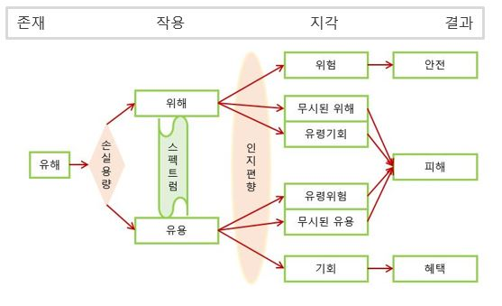

# 이론: 해결지향과 보도품질 {#literature}

### 위험-기회 모형을 이용한 해결지향 감염병보도 품질측정 제안 {-}

##### 안도현 {-}

#### 문제 제기 {-}

언론보도, 언론비평, 언론연구 등 거의 모든 분야에서 관심의 초점은 잘못된 것이다. 문제에 대한 지적이 주류다. 문제의 지적도 필요하지만, 지적만으로는 문제해결이 불가능하다. 문제해결의 틀안에서 보도, 비평, 연구가 이뤄질 필요가 있다. 이를 위해 먼저 보도품질에 대해 정의하고, 감염병보도의 맥락에서의 보도품질 판단에 대한 이론적 틀로서 위험-기회 모형을 제사시한 다음, 해결지향 감염병보도의 품질측정에 대해 논의한다. 


## 보도품질

### 정의 

보도품질에 대한 정의는 품질에 대한 일반적인 정의를 이용할 수 있다. 
[ISO의 품질(Quality)에 대한 정의](https://stats.oecd.org/glossary/detail.asp?ID=5150)는 다음과 같다. 

> 제품 혹은 서비스의 명시적 또는 암묵적 요구를 충족하는 능력에 대한 특성의 총체(The totality of features and characteristics of a product or service that bear on its ability to satisfy stated or implied needs.)

ISO의 품질정의를 보도품질에 대해 적용하면 다음과 같이 정의할 수 있다. 

> 보도의 명시적 또는 암묵적 요구를 충족하는 능력에 대한 특성의 총체

언론보도에 대한 명시적 암묵적 요구로는 정확성, 독창성, 심층성, 공정성 등 다양한 품질요소가 제시돼 있다 (오세욱 송해엽, 2020). 저널리즘을 사람들에게 자신이 살고 있는 세계를 이해하고, 삶에서 부딪히는 문제를 해결하는 데 필요한 정보를 제공하는 활동의 하나로서 일반 공공의 관심과 중요성을 담은 최신의 사안들에 대한 정보를 생산하고 유포하는 사업 혹은 활동이라고 정의한다면(김영욱 진민정 강신욱, 2014), 언론 보도에 대한 요구 사항의 핵심 요소는 공공의 관심과 중요성에 있다고 할 수 있다. 

### 뉴스의 가치

언론 보도에 대한 공중의 요구를 파악하기 위해서는 언론보도가 공공에 제공하는 가치를 통해 판단할 수 있다. 인간행동에 대한 진화적 접근에 따르면, 인간행동은 크게 원격인(ultimate cause)과 근접인(proximate cause)에 의해 결정된다. 근접인은 직접적으로 영향을 미치는 상황과 태도와 같은 변인들이며, 원격인은 간접적으로 영향을 미치는 유전, 문화, 양육 등과 같은 변인들로서 근접인에 대한 작용을 통해 인간행동에 영향을 미친다. 

원격인에 작용하는 핵심요소는 개체의 생존과 종의 생존(즉, 번식)이다. 오랜 세월 생존과 번식의 문제를 반복적으로 해결하는 과정에서 원격인이 구성된다. 진화적 접근은 생존과 번식의 문제를 해결하는 기능적 요소를 통해 인간 행동을 설명하므로 기능적 접근이라고도 할 수 있다. 
진화의 틀에서 기능적 접근을 통해 뉴스의 가치를 분석한 뉴스 가치 모형(Newsworthiness model)에 따르면 시의성, 근접성, 흥미성, 신기성 등 전형적으로 제시되는 뉴스가치의 기준들은 대부분 일탈성(deviance)과 사회적 중요성(social significance) 등 2개 차원으로 환원된다 (Shoemaker et al., 1991; Shoemaker & Cohen, 2006). 

사회적 중요성은 삶에 삶에 영향을 주는 정도를 의미하며 정치적, 경제적, 문화적, 및 공공 중요성이 있다. 사회적 중요성은 생존과 번식에 큰 영향을 주기 때문에 관심의 대상이 될수 밖에 없다. 

일탈성은 평균이나 규범에서 어긋나거나 사회질서를 위협하는 정도를 의미하며, 규범적(normative) 일탈성(규범이나 법에 어긋나는 정도), 사회변화(social change) 일탈성(기존 사회질서에 변화를 유발하는 정도), 그리고 통계적(statistical) 일탈성 (평균으로부터 매우 달라 새롭거나 기이하거나 신기한 정도)이 있다. 일탈성은 생존과 번식에 치명적 영향을 미칠 가능성이 있기 때문에 관심의 대상이다. 

```{r message=FALSE, warning=FALSE, include=FALSE}
pkg_v <- c(
  "tidyverse", "tidytext", "lubridate", "quanteda", "readtext", "seededlda")
purrr::map(pkg_v, require, ch = T)
```

## 위험-기회모형

뉴스의 가치는 맥락의존적이다. 어떤 사건의 일탈성과 사회적 중요성을 판단하기 위해서는 상황과 맥락에 대한 고려가 필요하다. 위험-기회 모형은 감염병 맥락에서 일탈성과 사회적 중요성을 판단하는데 필요한 이론적 틀을 제공한다. 위험-기회 모형은 실재와 인식의 불일치 현상을 토대로 위험소통의 실패와 성공을 설명하기 위해 제시됐다 (안도현, 2021a, 2021b).

우리가 알고 있는 세상은 세상 그 자체가 아니라 우리의 마음 속에 비친 그림자(모형)이므로 존재에 대한 우리 마음 속의 모형은 실제적인 일치 여부와 일치에 대한 지각 여부에 따라 4종으로 구분가능하다 (Table \@ref(tab:lit2)). 


```{r lit2, echo=FALSE, message=FALSE, warning=FALSE}
library(kableExtra)
tribble(
  ~`.`, ~`존재 유`, ~`존재 무`, 
  "지각 유", "진양성", "위양성",
  "지각 무",  "위음성", "진음성" ) %>% 
  kbl(booktabs = T, caption = "실재와 인식의 4개 유형") %>% 
  kable_classic() %>% 
  column_spec(1, bold = T)
  
```

### 위험의 4유형

실재와 인식의 4개 유형에서 실재를 피해가능성, 지각을 위해 지각으로 대치하면 피해가능성의 유무와 위해지각의 유무 등 2개 차원을 구성해 위험을 4개 유형으로 나눌 수 있다 (안도현, 2021a) (Table \@ref(tab:lit3)).  

```{r lit3, echo=FALSE, message=FALSE, warning=FALSE}
library(kableExtra)
tibble(
  `.` = c("위해지각 유", "위해지각 무"),
  
  `피해가능성 유` = c("1유형: 피해가능성이 있고 위해로 지각(예: 손실용량을 초과하는 위해로서 위해 현저성이 높은 경우: 고농도 화학물질, 병원성 바이러스, 자연재해, 테러 등)", 

"3유형(무시된 위해): 피해가능성이 있는데 위해가 아니라고 지각.
(예: 손실용량을 초과하는 위해이나 위해민감도가 현저하게 낮은 경우: 흡연, 음주, 과식, 가당음료 섭취, 운전 등)"),

`피해가능성 무` = c(
  "2유형(유령위험): 피해가능성이 미미한데 위해로 지각. (예: 손실용량을 초과하지 않는 위해에 대해 위해로 지각: 승인GMO, 저농도 화학물질, 저선량 방사선, 검증된 백신 등)", 
  
  "4유형: 피해가능성이 미미하고 위해가 아니라고 지각(사실상 위험이 아닌 유형) (예: 손실용량을 초과하지 않고, 사회적으로 친숙한 대상: 김치, 젓갈, 삼겹살구이 등에 포함된 발암물질)")

) %>% 
  
  kbl(booktabs = T, caption = "위험 4유형") %>% 
  kable_classic() %>% 
  kable_styling() %>% 
  column_spec(1, bold = T, width = "7em")
  
```

- **위험1유형**

진양성인 위험이다. 피해가능성이 실재하고 이를 위해로서 지각하는 유형이다. 

- **위험2유형(유령위험)**

위양성인 위험이다. 무시해도 되는 수준의 위해를 심각한 위해로 지각하는 유형이다. 피해가능성이 없는 위해이나 위험으로 지각해 위험으로 작용한다. 피해가 없는 위험으로 지각해 생기는 위험이므로 유령위험이라고 한다. 

- **위험3유형(무시된 위해)**

위음성인 위험이다. 피해가능성이 있는데도 위해로 대응하지 않는 유형이다. 무시된 위해다. 

- **위험4유형**

진음성인 위험이다. 피해가능성이 없고 위해로 대응하지 않는 유형이다. 모형에만 개념적으로 포함돼 있지 사실상 위험이 아니다. 


### 위험과 기회

생존과 번식의 문제를 해결하기 위해서는 위험에 대한 지각 뿐 아니라 기회에 대해서도 정확한 지각이 필요하다. 위험-기회 모형은 위험 4유형을 문제해결의 틀에서 유용과 기회를 추가해, 위험에 대한 회피와 기회에 대한 접근을 통합적으로 구현했다. 위험-기회 모형은 크게 존재, 작용, 지각 및 결과 등 4단계의 작용과정으로 구성돼 있다. 존재는 유해(harm), 작용은 위해(hazard)와 유용(usefulness), 지각은 위험(risk)와 기회(opportunity), 결과는 안전(safety), 피해(damage), 혜택(benefit) 등으로 이뤄져 있다 (안도현, 2021b) (Table \@ref(tab:lit3))
 

```{r lit4, echo=FALSE, message=FALSE, warning=FALSE}
library(kableExtra)
tibble(
  `단계` = c("존재", "작용", " ", "지각", " ", "결과"," ", " "),
  
   `개념` = c("유해(harm)", 
           "위해(hazard)", "유용(usefulness)", 
           "위험(risk)", "기회(opportunity)",
           "안전(safety)", "피해(damage)", "혜택(benefit)" ),
  
  `정의` = c("손실(loss)의 잠재적 요인",
           
           "손실용량 초과하는 유해가 피해(damage)로 이어지도록 하는 손실(loss) 가능성
(노출강도 X 노출빈도 X 노출확률)", "손실용량을 초과하지 않는 유해가 혜택(benefit)으로 이어지도록 하는 편익(gain) 가능성",

"위해에 대한 주관적 평가", "유용에 대한 주관적 평가",

"손실을 회피한 결과", "손실이 발생한 결과", "편익이 발생한 결과")

) %>% 
  
  kbl(booktabs = T, caption = "위험-기회 모형의 주요 개념") %>% 
  kable_classic() %>% 
  #kable_styling() %>% 
  column_spec(1, bold = T, width = "5em") %>%
  column_spec(2, bold = F, width = "9em") 
  
```

존재-작용-지각-결과의 과정을 그림으로 구성하면 다음과 같다 (Figure \@ref(fig:lit5)).

```{r echo=F, lit5, fig.cap="위험-기회 모형", dpi=40}


```


#### 존재: 유해 {-}

유해(harm)는 손실(loss)의 원천이 되는 사물, 사건 혹은 상황이다. 손실의 잠재적 요인으로서 작용 대상과 맥락에 따라 위해 혹은 유용으로 작용할 수 있는 가능성 단계다. 위해와 유용으로 작용할 가능성이 모두 있지만, 위험-기회 모형에서는 유해로 개념화했다. 무해로 전제하는 것 보다 유해로 접근하는 것이 생존과 번식에 유리하기 때문이다. 

#### 작용: 위해와 유용 {-}

존재 단계는 가능성이라면, 작용 단계는 존재가 실제로 작용하는 과정이다. 손실용량을 초과해 어떤 대상에 대해 피해로 이어진다면 위해가 되고, 손실용량을 초과하지 않아 혜택(benefit)으로 이어진다면 유용이 된다. 용량반응 관계(dose-response relationship)에 따르면 유해는 용량에 따라 위해로 작용하기도 하고 유용으로 작용하기도 한다. 독성학에서는 모든 것은 독으로서 오직 용량만이 독성여부를 결정한다고 본다 (Frank & Ottoboni, 2011)


#### 지각: 위험과 기회 {-}

지각 단계는 위험과 기회에 대한 지각 4종으로 이뤄져 있다. 위해 및 유용의 작용과 손실 및 편익 가능성의 유무에 따라 위험, 무시된 위해/유령기회, 유령위험/무시된 유용, 및 기회 등이다. 위험과 기회는 실재와 인식이 일치하는 경우이며, 무시된 위해/유령기회와  유령위험/무시된 유용은 실재와 인식이 불일치하는 경우다. 

**위험과 기회**

위험은 위해에 대한 주관적 평가이며 기회는 유용에 대한 주관적 평가로서 실재와 인식이 일치하는 지각 작용이다. 위해를 위험으로 지각하면 적절하게 대응해 안전을 달성할 수 있으며, 유용을 기회로 지각하면 혜택을 향유할 수 있게 된다. 

위험과 기회는 상반된 지각작용으로서 전자는 회피동기, 후자는 접근동기가 작용하지만, 위험과 기회의 구분은 명확하지 않다. 심지어 국제표준화기구(International Organization for Standardization)은 위험을 "목표에 대한 불확실성의 효과"로 정의하면서 그 효과를 부정성에만 국한지 않고 긍정성을 포함시킴으로써 위험의 정의에 기회를 포함시키고 있다 (ISO, 2018). 

위험과 기회의 구분이 명확하지 않은 이유는 위험감수가 없으면 기회를 포착할 수 없기 때문이다. 실제로 인류진보의 원천은 위험을 감수하는 모험에 있다. 이러한 위험과 기회의 혼재성이 위해와 유용에 대한 오지각의 원인이기도 하다. 

비록 위험과 기회가 실제 상황에서는 구분이 모호하고 혼재하더라도 개념적으로 구분할 필요가 있다. 위험과 기회에 작동하는 동기가 회피와 접근으로서 전혀 다른 작용의 결과로서 인간 행동 양식에 근본적인 차이가 있기 때문이다. 


**무시된 위해/유령기회**

존재와 인식의 불일치로서 위해를 무시하거나 심지어 기회로 여기는 오지각 현상이다. 무시된 위해는 위해와 피해에 대한 인과성이 확립돼 있음에도 불구하고 위해를 무시하는 경우다. 규범, 문화, 인지 편향 당 다양한 사회적 혹은 심리적 요인 등이 작용한다. 유령기회는 위해를 무시할 뿐 아니라 기회로 오판함으로써 초래하는 위험이다. 


**유령위험/무시된 유용**

유령위험(phantom risk)은 위해와 피해에 대한 인과성이 없거나 무시해도 될 정도로 미미함에도 불구하고 위험으로 지각하는 위험이다. 실제하지 위해를 위험으로 지각하기 때문에 유령위험이라고 한다. 유령위험의 지각 대상에 위해성이 없으나, 위해가 아닌 대상에 대해 위해로 지각해 대응하기 때문에 진양성의 위험보다 더 큰 피해를 초래할 수 있다. 무시된 유용은 유용을 과소평가하거나 유용을 위해로 오지각하는 위험이다. 유용을 향유할 기회를 상실하기 때문에 피해로 이어지게 된다. 


## 해결지향 감염병보도

### 해결지향 보도의 정의

해결지향 보도에 대해서는 해법저널리즘(solutions journalism)과 건설적 저널리즘(constructive journalism) 등의 명칭으로 언론현장과 학계의 접근이 있어 왔다. 여러 쟁점이 있지만, 해결지향 보도의 강조점에 차이가 있다. 한편으로는 사회현상을 적절하게 반영하는 기능을 강조하고, 다른 한편에서는 사회 현상에 대한 능동적 개입을 강조한다. 해결지향 보도를  관찰자로서 사회현상의 모든 측면(부정사건과 긍정사건의 실제 발생 비율에 맞춰 전달)을 전달하는 보도양식인지 혹은 능동적으로 개입해 사회변화 유도. 사회문제에 대한 가능한 해법을 비판적으로 탐색하는 보도 양식인지에 대한 구분이다 (Bro, 2008; Lough & McIntyre, 2019)

두 접근을 통합하면 해결지향 보도는 사회현상을 실재와 가능한 일치하도록 반영하면서, 증거와 효과에 기반해 문제해결의 틀 형성에 기여하는 보도로서 다음과 같이 정의할 수 있다.

> 사회문제에 대한 체계적 대응을 증거와 효과에 기반해 면밀하게 전달함으로써 사회 현상의 본질을 전달해 개인과 사회가 문제해결의 목적을 달성할 수 있도록 기여하는 보도 방식 


### 감염병보도의 가치

해결지향 보도의 3가지 요소(현실 반영, 문제해결 틀, 증거와 효과)를 감염병 보도에 적용하면, 감염병보도의 가치는 1) 감염병 상황을 ‘있는 그대로‘ 반영하는가? 2) 감염병 창궐의 문제 해결에 기여하는가?등 2가지로 요소로 압축할 수 있다. 

위험-기회 모형의 틀에서 감염병보도의 가치를 판단한다면, 감염병으로 인한 위해를 공중이 위험으로 지각하도록 하고, 감염병 대응에 필요한 유용한 자원을 기회로 지각하도록 하는지와 이를 증거와 효과에 기반해 구체적으로 전달하는지의 여부를 활용할 수 있다. 

해결지향 감염병보도는 다음과 같이 정의할 수 있다. 

> 감염병문제에 대한 체계적 대응을 증거와 효과에 기반해 면밀하게 전달함으로써 위해를 위험으로 지각하고 유용을 기회로 지각하도록 하는 보도 

## 품질측정

해결지향 감염병보도의 가치요소를 기반으로 보도 품질에 대한 지표는 크게 정확성, 구체성 그리고 관심성 등 3개 요소로 요약할 수 있다. 정확성에는 위험지각의 정확성(위해성에 대한 정확한 반영)과 기회지각의 정확성(유용성에 대한 정확한 반영)이 있다. 구체성은 감염병 보도에 증거, 과정 및 효과 등이 포함되는 여부다. 관심성은 중요성(생존과 번식에 미치는 영향의 정도)과 일탈성(생존과 번식에 대한 잠재성 영향 가능성)이 있다. 

품질측정을 위해서는 정확성, 구체성, 및 관심성 3개 요소를 모두 포괄해야 하나, 이 연구에서는 우선 정확성 지표만 다루기로 한다. 

감염병보도에서 정확성은 위험과 기회 지각이 위해성과 유용성에 대한 정확하게 반영하는 정도다. 정확성은 개별 기사 차원과 집합기사 차원으로 구분 가능하다. 개별 기사 차원의 정확성은 개별 기사의 내용이 현실을 반영하는 정도이며, 집합 기사 차원의 정확성은 기사 양의 현실 반영 정도를 의미한다. 즉, 언론보도의 정확성은 보도하는 주제의 분포에 의해 판단할 수 있다. 

### 보도해야 하는 내용

감염병이 창궐하는 상황에서 언론이 다뤄쟈 하는 주제는 크게 위해와 유용으로 구분된다. 위해의 영역에서는 위험과 무시된위해/유령위험에 대한 내용이 보도돼야 하고, 유용의 영역에서는 유령위험/무시된 유용과 기회에 대한 내용이 보도돼야 한다.  

**위해-위험**
코로나19 위해에 대한 체계적 정보 전달(감염 및 위해 대응 현황 등)

**위해-무시된위해/유령기회**
허위정보 현황 및 그로 인한 피해

**유용-유령위험/무시된유용**
백신미접종에 따른 중증 및 사망 현황
백신접종에 따른 피해보다는 백신 미접종에 대한 피해 사례가 압도적으로 많기 때문에, 일탈성의 뉴스가치를 고려해도, 백신미접종으로 인한 피해에 대한 보도가 백신접종으로 인한 피해보도보다 훨씬 양이 많아야 한다. 

**유용-기회**
백신접종, 검사 및 의료자원 투입 현황 및 이로 인한 성과


